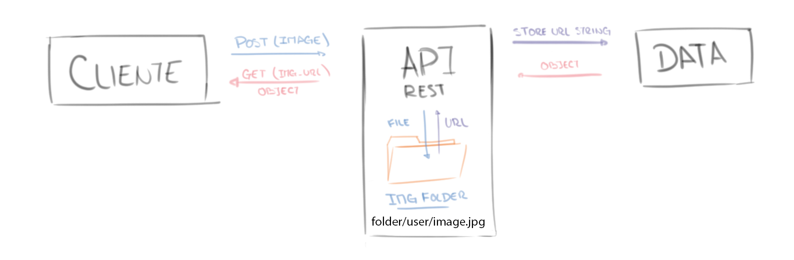

# Image API e implementacion en Angular app  
El principal objetivo de este "mini-proyecto" fue el desarrolo de una API REST para la gestion de imágenes. Que sea capaz de generar un url enlazando la imagen obtenida desde el FronEnd y almacenarlo en una BBDD o retornarlo.  

   

